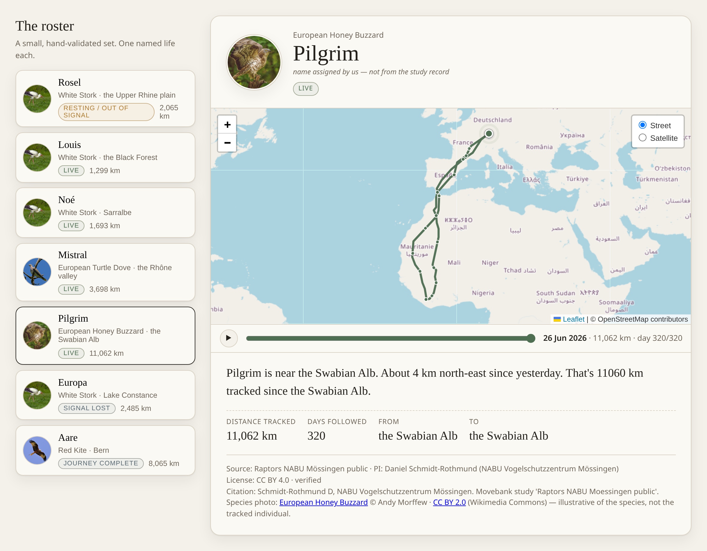
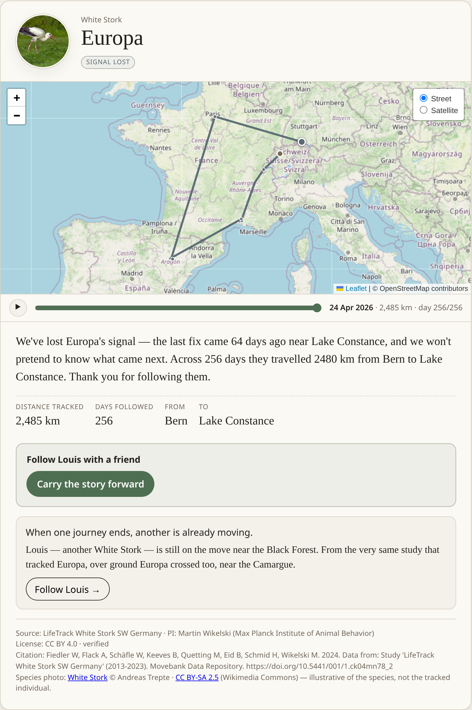
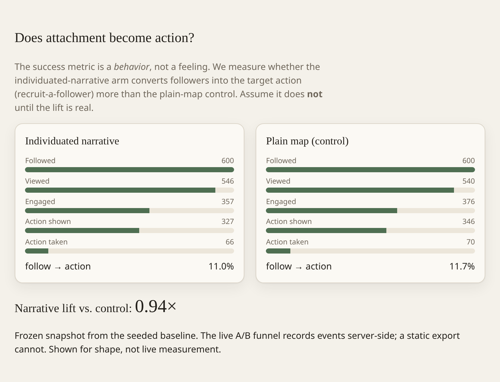

# Still Here — a continuity-first parasocial animal tracker

> Engineer **continuity of attachment across the discontinuity of the data.**
> The map is the commodity; staying with the user when the signal stops is the product.

A low-friction app where a person follows **one named, individuated, real wild animal**
sourced from [Movebank](https://www.movebank.org), receives grounded present-tense
narrative updates about its journey, and — when the tag goes quiet or the animal dies —
experiences a **designed narrative resolution and a graceful handoff to a successor**,
never a broken map pin. At emotional peaks it offers exactly **one** consequential action
and **measures whether attachment actually transfers to that action** via a built-in A/B test.



> *The follow view. Left: the roster of named, real individuals, each with a species
> portrait so you know the animal at a glance. Right: one life's journey — Pilgrim, a
> Honey Buzzard, and her 11,062 km loop to West Africa and back — drawn over a real
> Leaflet map with a time scrubber to replay the route. [Try it live.](https://hugofara.github.io/still-here/)*

This repo implements the [build brief](./movebank-parasocial-drief.md) as a runnable
vertical slice. The **server runtime has no npm dependencies**: everything runs on the
Node ≥ 24 standard library (native TypeScript, `node:sqlite`, `node:test`, the built-in
HTTP server, global `fetch`) with no install. The journey map uses [Leaflet](https://leafletjs.com)
— **vendored as a static asset** in `src/web/vendor/` (not an npm dependency), with
street/satellite tiles fetched from OpenStreetMap + Esri World Imagery at view time
(so the map needs network). `npm install` pulls only **dev-only** tooling
(`typescript`, `@types/node`, and `playwright` for `npm run shots` screenshots);
`npm run typecheck` is the optional type gate.

---

## Decisions taken (brief §9)

| Decision | Choice |
|---|---|
| Scope | Full vertical slice, milestones 1–7, runnable end-to-end (real API behind fixtures, LLM mocked) |
| Geography | **Europe-focused** — migratory birds whose ranges sweep past a Geneva user |
| Target behavior | **Recruit-a-follower (diffusion)** — measurable in-app, drives reach, feeds the dynamic-norms stretch goal |
| Licensing posture | **Fully-public studies only**; per-study license + attribution surfaced and respected |

---

## Quick start

```bash
# 1. Seed the curated roster + run ingestion once (offline, deterministic)
npm run seed

# 2. Start the follow app
npm start
# → open http://localhost:8787

# other commands
npm test          # 69 unit/integration tests (all pure modules + client fixtures)
npm run typecheck # tsc --noEmit (strict); dev-only deps
npm run curate    # print the ranked curation report with provenance (§4 deliverable)
npm run ingest    # re-run ingestion against existing fixtures (a few×/day in prod)
npm run live:check # read a real fully-public Movebank study through the live client
npm run static    # build the static GitHub Pages export into ./docs
```

The offline demo's clock is anchored to the snapshot instant (2026-06-26), so the
real tracks' five continuity states stay stable and honest; `MOVEBANK_MODE=live`
uses the real clock and reads live positions.

### Run anywhere (container)

```bash
docker build -t still-here-demo .      # or: podman build …
docker run -p 8787:8787 still-here-demo  # → http://localhost:8787
```

Boots in fixture mode — no Movebank secret, no network for data. `.dockerignore`
keeps `.env` out of the image.

### Static demo → GitHub Pages

`npm run static` boots the same seeded service in-process and **pre-bakes the
deterministic fixture payloads to JSON** (both A/B arms + the successor handoff
variants + a frozen funnel snapshot) under `./docs`, then `src/web/app.js` runs in
static mode and loads those instead of `/api`. The whole follow experience is
faithful — roster, the Leaflet map (its tiles are external, so they still load),
narrative, continuity states, the successor bridge. The **live A/B measurement is
the one thing a static host can't do** (recording events needs a server-side
store), so the experiment view shows the seeded snapshot, labelled as such.

Publish: **Settings → Pages → Source: Deploy from a branch → `main` / `/docs`** →
`https://hugofara.github.io/still-here/`.

---

## What you'll see

A roster of seven **real, named** European individuals — drawn from fully-public
Movebank studies and chosen so their genuine last-fix recency exercises **every**
continuity state — plus one synthetic demonstrator for the one state that cannot
be sourced from public data:

| Animal | Species | Source study | State (from real recency) |
|---|---|---|---|
| **Louis** | White Stork | LifeTrack SW Germany · `21231406` | `LIVE` — back on the Upper Rhine after wintering in Catalonia |
| **Noé** | White Stork | LifeTrack Sarralbe · `1562253659` | `LIVE` — breeding in NE France; winters in Iberia |
| **Mistral**¹ | European Turtle Dove | Habitrack · `3413045568` | `LIVE` — Menorca-tagged, now in the **Rhône valley** (nearest Geneva) |
| **Pilgrim**¹ | European Honey Buzzard | NABU Mössingen · `186178781` | `LIVE` — long-distance Afro-Palearctic migrant |
| **Rosel** | White Stork | MPIAB ELSA 2.0 · `3883692006` | `QUIET` — genuinely silent ~14 days; framed as resting, not alarm |
| **Europa** | White Stork | LifeTrack SW Germany · `21231406` | `RESOLVED_UNKNOWN` — signal stopped 64 days ago; honest closure |
| **Aare**¹ | Red Kite | Milvus atlantis · `672882373` | `RESOLVED_KNOWN` — Swiss deployment ended 2022; designed ending + successor |
| **Pip** | _synthetic demo_ | — | `PERMISSION_LOST` — access revoked; **retires silently**, never shown as "disappeared" |

¹ Name **assigned by us** (no personal name in the study record) and labelled as such in the UI.

> ⚠︎ **Honesty.** Every track above except **Pip** is a **real, unmodified Movebank snapshot**
> of a named individual from a fully-public study, captured 2026-06-26 and downsampled for the
> offline build (`src/roster/real-tracks.generated.ts`; live ingestion reads full resolution).
> Their continuity states are **not engineered** — they fall out of each bird's real last-fix
> recency. Provenance is **verified** (2026-06-28, via the account holder's authenticated Movebank
> `direct-read`): each carries its owner-set license, PI and citation in `CONFIRMED_PROVENANCE`.
> Licenses **differ** — CC0 (Sarralbe), CC BY (the other storks, dove, raptor) and **CC BY-NC**
> for the Red Kite — so attribution is shown per study and the kite is **non-commercial** use only.
> **Pip** is the lone synthetic entry: a public study cannot revoke your access, so the
> PERMISSION_LOST mechanism (denial ≠ tag death, §2.3) cannot be sourced from real public data.

The **species portraits** in the roster and follow view are freely-licensed reference photos
(Wikimedia Commons), **vendored locally** and shown so you can recognise the animal — they
illustrate the **species**, not the specific tracked individual, and are unrelated to the
tracking studies. Per-photo credits and licenses: [`src/web/img/CREDITS.md`](./src/web/img/CREDITS.md).

---

## Architecture

```
[ Movebank public-JSON / v2-REST ]      ← MovebankClient (fixture | live transport)
            │  poll a few×/day
            ▼
[ Ingestion worker ] → [ SQLite store: studies, individuals, fixes, status, events ]
            │                    │
            │                    ▼
            │            [ Continuity engine ]  ← pure, fully unit-tested (the differentiator)
            │                    │
            ▼                    ▼
[ Roster curation (scoring) ]   [ Narrative generator ] ← grounded packet → mock | Anthropic LLM
                                     │
                                     ▼
                  [ HTTP API + follow UI ]  ← one-animal view, A/B arms, action bridge + funnel
```

Layout:

```
src/
  domain/        types.ts · continuity.ts (state machine) · geo.ts · places.ts (gazetteer) · geocode.ts (Geocoder seam)
  movebank/      client.ts · transport.ts · errors.ts · types.ts · live-check.ts
  store/         repository.ts (interface) · sqlite-store.ts · async-repository.ts · postgres-store.ts
  roster/        scoring.ts · seed.ts (REAL roster) · real-tracks.generated.ts · track-builder.ts · successor.ts · report.ts
  narrative/     grounding.ts (pure) · generator.ts (cache + provider)
  llm/           provider.ts (MockLLMProvider | AnthropicLLMProvider)
  experiment/    ab.ts (assignment · action bridge · funnel)
  ingestion/     worker.ts · seed-runner.ts · run.ts · scheduler.ts
  server/        app.ts (HTTP) · roster-service.ts
  web/           index.html · styles.css · app.js (the follow UI)
test/            *.test.ts (continuity, client, store, scoring, narrative, ingestion, ab,
                 real-shape, geocode, postgres)
fixtures/        recorded Movebank responses (incl. fixtures/movebank/real/ from the live API)
```

The **continuity state machine** (`src/domain/continuity.ts`) is pure — no I/O, no clock
access; the caller injects `now` and grounded inputs. It is the heart of the product and
the most heavily tested module.

---

## The continuity engine (brief §5)

`computeStatus(input)` is total and deterministic. Priority order (highest first):

1. `PERMISSION_LOST` — the API now denies data. **Orthogonal to tag silence** and wins
   over everything → retire silently. *This is the §2.3 invariant: permission-denied is
   never conflated with a quiet tag.*
2. `RESOLVED_KNOWN` — owner/data says death · tag-removed · study-ended.
3. gap-based: `LIVE` (within cadence) → `QUIET` (past cadence, still hopeful) →
   `RESOLVED_UNKNOWN` (beyond the lost threshold).

Every state emits **directives** (framing, tone, whether to show the action, whether to
offer a successor, whether to retire). The invariant `alarm: false` holds across all
states and is asserted in tests — a quiet tag is "resting / out of signal", never an error.

---

## The successor handoff — the differentiator (brief §5)

The moment a tag resolves is where competitors drop the user and where this product does
its real work: it **transfers the attachment** instead of ending it. A resolution doesn't
just name a "next animal" — it builds a **grounded bridge** (`src/roster/successor.ts`,
pure):

- `pickSuccessor` prefers the **same species**, then the same theme; among equally-kindred
  birds it softly prefers one that is genuinely **LIVE** over a live-eligible-but-quiet one,
  so the follower is handed something vital — never enough to override kinship (a quiet
  stork still beats a live dove for a stork's follower).
- `describeConnection` computes, from real data only, *why this successor*: same species?
  same Movebank study? a **named place both tracks pass near**? where the successor is right
  now? `buildHandoffBridge` turns those facts into one warm, grounded sentence and **never
  claims a link the data lacks**.
- The invite (`shareText`) — the artifact that actually diffuses — inherits the same
  grounded connection, so a recruited friend arrives already inside the continuity.
- Clicking the handoff carries the thread: the successor view opens with a *"Continuing from
  Europa's journey"* ribbon (`continuedFrom`), so a handoff reads as continuation, not a
  fresh start.

On the real roster this produces, e.g., *"Louis — another White Stork — is still on the move
near the Black Forest. From the very same study that tracked Europa, over ground Europa
crossed too, near the Camargue."* All four claims (species, study, shared place, current
position) are grounded in the fixes. Covered end-to-end in `test/handoff.test.ts`.



> *A resolution, not a broken pin. Europa's tag fell silent; the view closes the journey
> honestly and hands the follower onward to Louis — another White Stork, from the very same
> study, over ground Europa crossed too. The single action ("carry the story forward") and the
> grounded successor bridge are exactly what the A/B test below measures.*

---

## Honesty / grounding (brief §6)

The narrative generator can only speak facts present in a **grounding packet**
(`src/narrative/grounding.ts`) built purely from real fixes + status + metadata. A test
asserts the packet exposes only whitelisted fields — there is no channel for un-grounded
biography. The default provider is a deterministic, fully-grounded template renderer
(`MockLLMProvider`), so the offline slice produces honest prose with no API and no
hallucination. Set `NARRATIVE_PROVIDER=anthropic` + `ANTHROPIC_API_KEY` to use a real
model under a system prompt that forbids inventing anything outside the packet. Narratives
are cached keyed to the fix batch (cost + consistency).

---

## The action bridge + A/B harness (brief §7)

Success is a **behavior, not a feeling**. At emotional peaks (a landmark crossed, or a
resolution) the product surfaces **exactly one** action — recruit a follower (or hand off
to a successor). The control arm sees a **plain map** with no individuated narrative and a
bare *next-animal* handoff; the treatment arm sees the full individuated story and the
**grounded handoff bridge**. Both arms get the same single action and the same successor
target, so the experiment isolates whether individuation (narrative + grounded bridge), not
the bare offer, is what drives diffusion.

`GET /api/experiment` (and the **Experiment** tab in the UI) reports the funnel
`follow → view → engage → action_shown → action_taken` per arm, plus the narrative arm's
**lift** over the control on `follow → action`. The seeded traffic is constructed with
*equal* conversion across arms (lift ≈ 1.0) — the demo shows the **instrument**, not a
fabricated win. **Assume attachment does NOT transfer to the action until the lift is real.**



> *The experiment tab. Per-arm funnels (`follow → view → engage → action_shown →
> action_taken`) and the narrative lift over control. The seeded snapshot reads **0.94×** —
> an honest, equal-conversion baseline. The instrument is the point; the win has to be earned.*

---

## Validated against live Movebank (2026-06-27)

The live read path is proven end-to-end, not just mocked:

```bash
npm run live:check          # reads a real fully-public study through the real client
# → Parsed 16028 fixes through the real client.  (study 2911040, Galapagos Albatrosses)
```

What this established and hard-wired:

- The **public JSON service requires `sensor_type`** — omitting it returns HTTP 500, *not*
  an empty result. `LiveTransport` now always sends it (default `gps`).
- The real location shape is `{ individuals: [ { individual_local_identifier,
  individual_taxon_canonical_name, locations: [ { timestamp (ms), location_long,
  location_lat } ] } ] }` — exactly what the normalizer targets. A trimmed real response is
  checked in at `fixtures/movebank/real/` with a regression test (`test/real-shape.test.ts`)
  so contract drift is caught.
- Study **listing / `direct-read` require auth** (HTTP 401 without a token) — confirming the
  §2.3 model: enumerating public studies is the human/credentialed step, not an open API.

### The roster is real (wired from live Movebank)

The `?entity_type=study` endpoint *does* return a tokenless directory of the **164
fully-public studies** (`suspend_license_terms=true`). We filtered it to European
birds, **read live fixes** to confirm taxon / recency / geography, and selected the
seven named individuals above. Their downsampled tracks are committed in
`src/roster/real-tracks.generated.ts` (regenerate with `node scripts/capture-real-roster.mjs`).

- `npm run seed` builds the roster from that real snapshot offline (deterministic).
- `MOVEBANK_MODE=live npm run ingest` re-reads them from the **live** public service
  end to end — proven: e.g. *Mistral* +31k, *Pilgrim* +49k real fixes pulled.
- Two facts this surfaced and hardened: (a) a single individual can return **>500k**
  fixes, so `normalizeFixes` pushes in a loop (spreading overflowed the arg stack) and
  live reads are **bounded** to `MOVEBANK_LOOKBACK_DAYS` (default 120); (b) the demo
  clock is anchored to the capture instant so a frozen snapshot stays honest.

## Going live (what to swap)

- **Data**: set `MOVEBANK_MODE=live`. Public studies read with no token via the public JSON
  service (validated above); the v2-REST surface and study enumeration need a free Movebank
  account + token. The client already implements the license-acceptance handshake and the
  permission-denied vs no-data distinction.
- **Provenance — done (2026-06-28).** With a free Movebank account, the authenticated
  `direct-read` service returns each study's owner-set license/PI/citation (the public JSON
  service alone caps study metadata at 4 fields, so this genuinely needs the credentialed step).
  All seven real individuals are now `provenance.verified = true` — see `CONFIRMED_PROVENANCE` in
  `src/roster/seed.ts`. Confirmed licenses: **CC0** (Sarralbe — Fiedler); **CC BY** (SW Germany —
  Wikelski, DOI `10.5441/001/1.ck04mn78_2`; Habitrack dove — Jiguet; NABU Mössingen —
  Schmidt-Rothmund; ELSA 2.0 — Fiedler); **CC BY-NC** (Red Kite — Scherler, **non-commercial**).
  Owner resolutions (death/tag-removed/study-end) should still come from real deployment +
  mortality metadata via `repo.setResolution`; the Swiss kite's `study-ended` is an honest
  placeholder pending that.
- **Source the missing species**: **re-verified 2026-06-28** across all 164 fully-public studies —
  there are exactly **3 osprey** studies (all with **zero** recent fixes; two Swedish/historical,
  one US) and **zero** Northern Bald Ibis studies of any kind. So no fully-public live European
  osprey and no bald ibis exist: those families (and the "over Lake Geneva" flagship) need either
  a licensed study (a human license-acceptance step) or a non-Movebank source.
- **Places**: a `Geocoder` seam exists (`src/domain/geocode.ts`) — `GazetteerGeocoder`
  (offline default) and `NominatimGeocoder` (live OSM reverse-geocode, cached + UA per the
  usage policy). In production, resolve names during ingestion so grounding stays pure.
- **Narrative**: flip to the Anthropic provider (`NARRATIVE_PROVIDER=anthropic`).
- **Scheduling**: `npm run schedule` runs the ingestion loop in-process
  (`INGEST_INTERVAL_MIN`, default 6h, graceful shutdown); or point a real cron / k8s CronJob
  at `npm run ingest`.
- **Store**: `SqliteRepository` (sync) implements `Repository`. For Postgres, an
  `AsyncRepository` seam + `PostgresRepository` (`src/store/postgres-store.ts`, driver-agnostic
  via an injected `SqlClient`; no hard `pg` dependency) are provided and unit-tested against a
  fake client; `toAsync()` lets the sqlite store satisfy the same async interface. Wire a real
  `pg` Pool + run the DDL to go live.

---

## Stretch (brief §8.8)

Dynamic norms ("a growing number of people following Aila have invited a friend") are not
precluded: the funnel already records per-arm trajectories over time, so the surface can
be added once real follower-action data accumulates.
